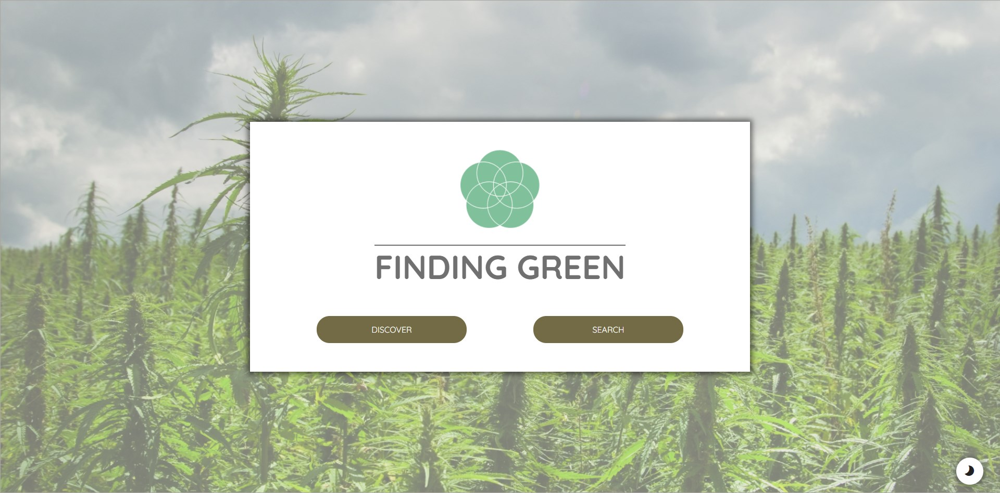
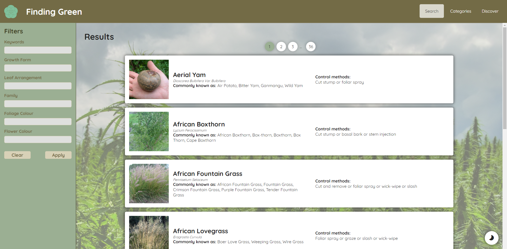
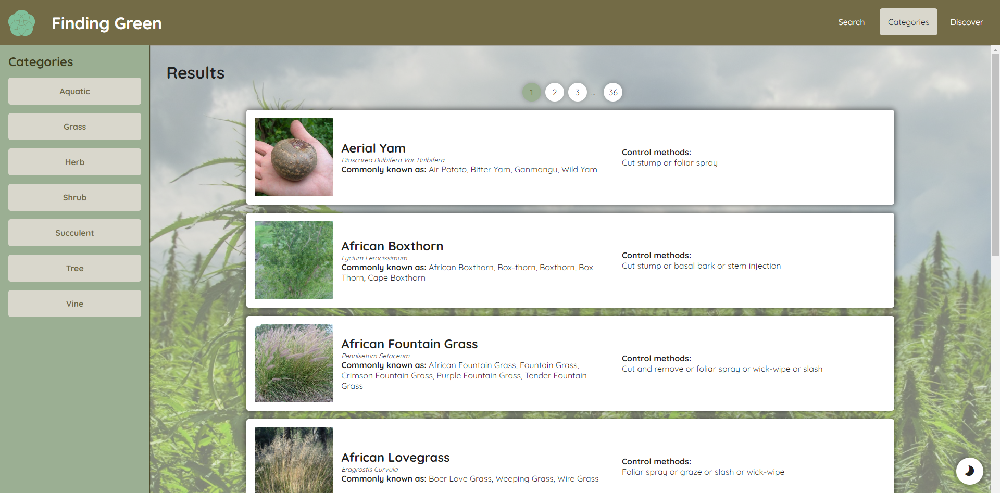
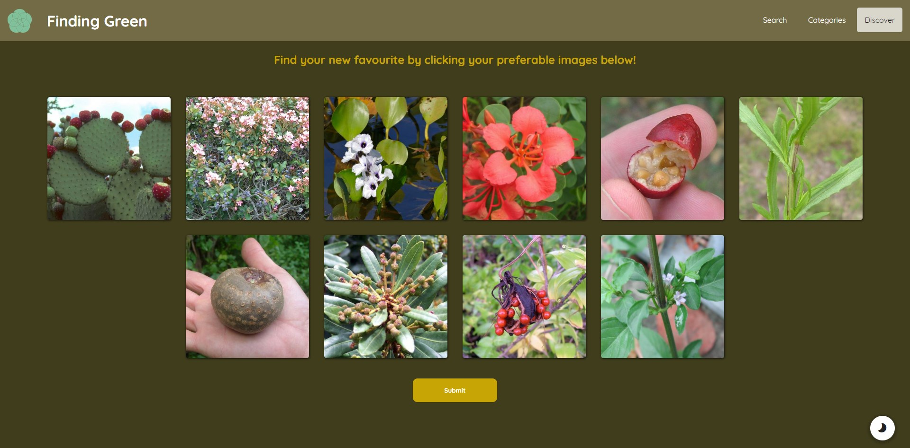

# Finding Green

Finding Green is an dynamic web application created as part of my DECO7180 Design Computing Studio 1 - Interactive Technology course at the University of Queensland. It makes use of SQL and PHP to dynamically grab data from the Brisbane City Council’s Weed Identification dataset for storage and updating.

As part of this subject, I assumed the role of project leader, and full-stack developer, creating both the front-end and back-end systems for Finding Green from scratch.

## Search

Finding Green features a comprehensive search engine where users can enter in any data they wish into the filters on the left, and the results will be updated on the right hand side.

## Categories

Similar to the Search Engine, this page initially displays all weeds in the dataset, but can be filtered using the buttons on the left hand side to just show weeds of one species.

## Discover

The Discover page is our website’s main attraction, which uses images to guide the user. Users will see a grid of images, from which they can choose the ones that appeal to them. The back-end uses an algorithm to display new weeds with similar flower colours to those already selected by the user. Users can also go back to revert their choices.